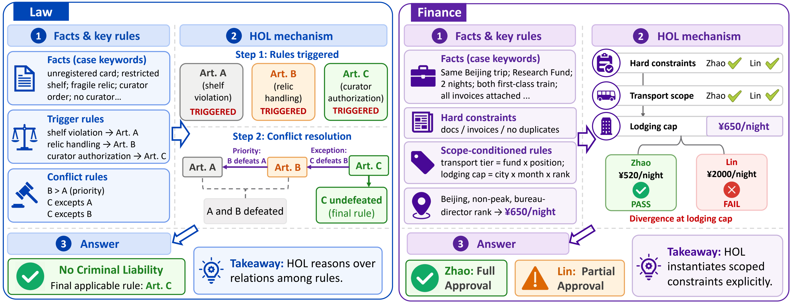
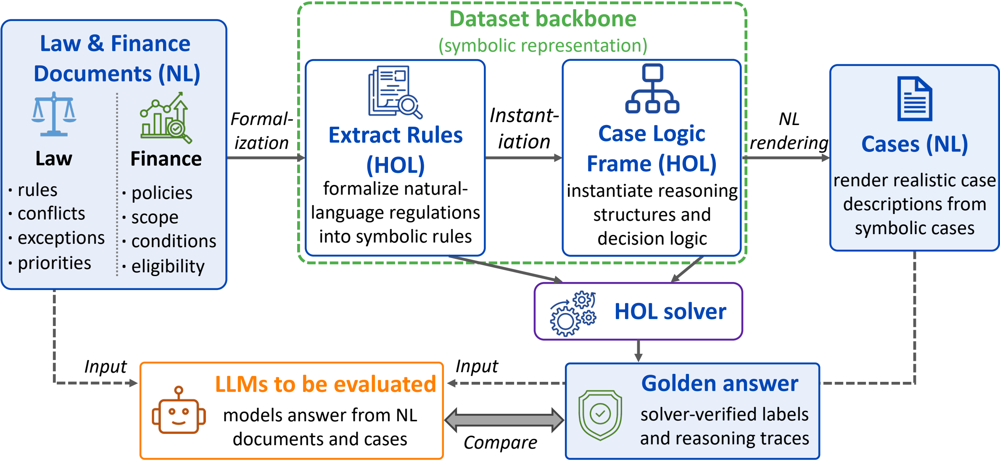
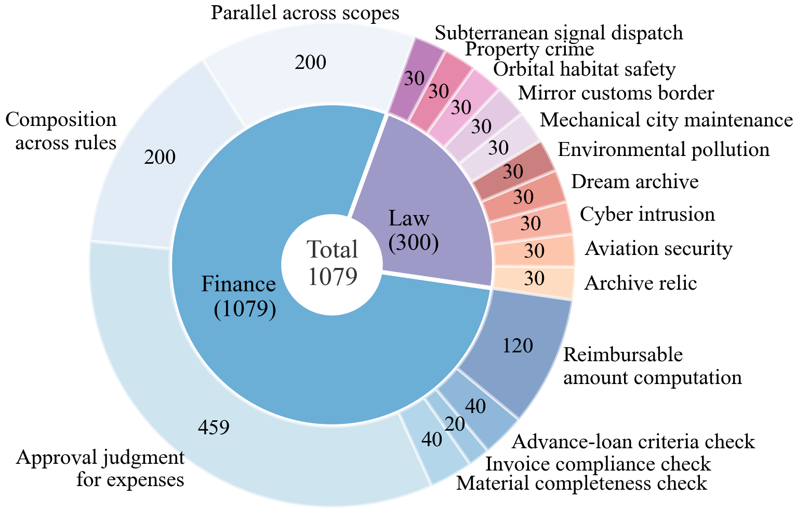
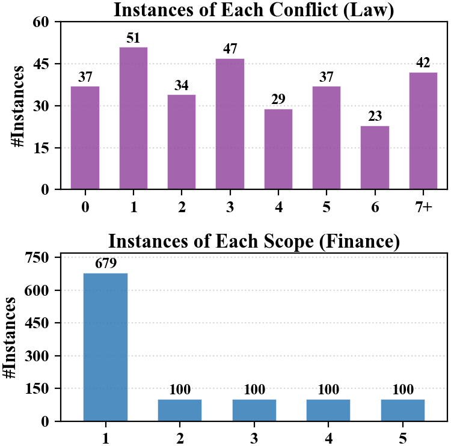

# HOLMES — Higher-Order Logic Meets real-world Explainable Symbolic reasoning

This repo accompanies the paper **“HOLMES: Evaluating Higher-Order Logical Reasoning in LLMs.”** It releases the **HOLMES** benchmark (1,379 instances across **law** and **finance**) together with two self-contained pipelines for evaluating LLMs on rule-application reasoning.

## Table of contents

- [Paper at a glance](#paper-at-a-glance)
- [Code: running the benchmarks](#code-running-the-benchmarks)
  - [Layout](#layout)
  - [Setup](#setup)
  - [Reasoning-trace metrics](#reasoning-trace-metrics)
- [Law benchmark](#law-benchmark)
- [Finance benchmark](#finance-benchmark)
- [Citation](#citation)
- [License](#license)

## Paper at a glance

Logical reasoning benchmarks for LLMs are largely **first-order-logic-centric** — they evaluate deduction over objects under fixed predicates. Many realistic scenarios go further: models must reason **about the rules, predicates, functions, and decision procedures themselves** — comparing rules, composing constraints, resolving exceptions, and selecting scope-specific policies. HOLMES is the first real-world benchmark to target this **higher-order** regime.

Each instance pairs:

- a natural-language problem,
- an Isabelle/HOL formalization,
- a verified ground-truth answer,
- a step-by-step reasoning trace, and
- fine-grained controllable reasoning factors (rule depth, conflict count, scope count, …).

The two portions stress complementary higher-order patterns:

| Portion | Focus | Instances | Rules | Avg. depth | Context length |
|---|---|---|---|---|---|
| **Law** | Rule priority, exception/exemption, article-level conflicts | 300 | 285 | 11.47 | 480 – 696 tokens |
| **Finance** | Scope-conditioned policy selection, constraint composition, numerical aggregation | 1,079 | 58 | 17 | 830 – 4,918 tokens |

<p align="center">
  
  <br/>
  <em>Worked examples. <b>Law:</b> rule-level reasoning — priority/exception relations defeat competing articles, leaving Art. C undefeated. <b>Finance:</b> scope-conditioned constraint checking — two claims pass the same initial checks but diverge at the ¥650/night lodging cap, yielding full vs. partial approval.</em>
</p>

<p align="center">
  
  <br/>
  <em>Construction pipeline. Natural-language documents are formalized into HOL rules, instantiated into case logic frames, and rendered into natural-language cases. An HOL solver produces verified gold answers used to evaluate LLMs.</em>
</p>

<p align="center">
  
  &nbsp;
  
  <br/>
  <em>Left: instance distribution across domains and task types. Right: instance counts by conflict count (law) and scope count (finance).</em>
</p>

We benchmark **11 LLMs** (9 open-source + 2 proprietary). The full results table — final-answer accuracy plus reasoning-trace quality (ROUGE-L, BERTScore-F1, ROSCOE) — is reproduced below.

| Type | Model | Law Acc | Law ROUGE-L | Law BERT-F1 | Law ROSCOE | Finance Acc | Fin. ROUGE-L | Fin. BERT-F1 | Fin. ROSCOE | **Overall Acc** |
|---|---|---:|---:|---:|---:|---:|---:|---:|---:|---:|
| Open | DeepSeek-V3.2 | 74.67 | 33.92 | 0.8920 | 0.7810 | 39.85 | 20.88 | 0.8327 | 0.6577 | 47.43 |
| Open | DeepSeek-R1 | 63.33 | 35.80 | 0.8829 | 0.7990 | 46.43 | 23.85 | 0.8520 | 0.6631 | 50.11 |
| Open | DeepSeek-V4-Flash | 68.67 | 36.93 | 0.8841 | 0.7983 | 46.06 | 21.92 | 0.8380 | 0.6525 | 50.98 |
| Open | DeepSeek-V4-Pro | 71.48 | 36.26 | 0.8841 | 0.8014 | 36.98 | 21.18 | 0.8299 | 0.6390 | 44.49 |
| Open | Qwen3-30B-Instruct | 83.67 | 35.97 | 0.8819 | 0.7766 | 38.37 | 22.13 | 0.8445 | 0.6523 | 48.22 |
| Open | Qwen3-30B-Thinking | 77.33 | 33.53 | 0.8765 | 0.8352 | 48.75 | 20.68 | 0.8239 | 0.6537 | 54.97 |
| Open | **Qwen3.6-Flash** | **86.33** | 35.27 | 0.8749 | 0.8209 | **52.09** | 21.52 | 0.8430 | 0.6608 | **59.54** |
| Open | MiniMax-M2.5 | 74.44 | 33.74 | 0.8573 | 0.8207 | 49.30 | 24.39 | 0.8452 | 0.6672 | 54.77 |
| Open | MiniMax-M2.7 | 67.04 | 32.43 | 0.8454 | 0.8111 | 41.15 | 24.78 | 0.8415 | 0.6655 | 46.78 |
| Prop | GPT-5.4-Mini | 77.67 | 34.12 | 0.8888 | 0.8285 | 36.42 | 23.99 | 0.8421 | 0.6943 | 45.39 |
| Prop | Gemini-3.1-Flash | 84.00 | 33.20 | 0.8795 | 0.8107 | 46.06 | 21.41 | 0.8448 | 0.6547 | 54.31 |
| | **Average** | **75.33** | 34.65 | 0.8770 | 0.8076 | **43.77** | 22.43 | 0.8398 | 0.6601 | **50.64** |


# Code: running the benchmarks

The repo ships **two parallel pipelines**, one per portion of HOLMES. Both follow the same loop:

> hit a chat-completions API → save per-case JSON → score against gold → roll up per-model metrics.

Each portion is split into two scripts so the API stage and the scoring stage can run independently:

- **Law** — `law_run.py` (API → `law_per_case_results.json`) + `law_accuracy.py` (scoring → CSVs).
- **Finance** — `finance_run.py` (API → per-case JSONL) + `finance_accuracy.py` (scoring → CSV).

Both write into per-pipeline output directories: `law_results/<MODEL>/` and `finance_results/<MODEL>/`.

## Layout

```text
./
  README.md  requirements.txt  LICENSE

  # ── Law ──────────────────────────────────────────────────────────────────
  law_run.py                    # API stage   → law_results/<MODEL>/law_per_case_results.json
  law_accuracy.py               # scoring     → law_case_metrics.csv + law_aggregate_*.{csv,json}
  law_reasoning_metrics.py      # ROUGE-L / BERTScore-F1 / ROSCOE-SA / SRMR over saved traces
  law_data/                     # datasets.json (10 bundles × 30 cases) + law_nl_traces.json (300 gold traces)

  # ── Finance ──────────────────────────────────────────────────────────────
  finance_run.py                # API stage   → finance_results/<MODEL>/*.jsonl
  finance_accuracy.py           # scoring     → finance_model_comparison_table.csv (per-dataset + overall accuracy)
  finance_reasoning_metrics.py  # ROUGE-L / BERTScore-F1 / ROSCOE-SA / SRMR; appends to the comparison table
  finance_data/                 # sample{1,2,3}.json, gold.json, case_index.json, fudan_reimbursement_rules.json,
                                # prompts_en.py, scoring_rules.py (TASK_CONFIGS + get_nested_value),
                                # sample3_spec.py (case-id → prompt → result-file → eval-task map)
```

## Setup

Python 3.10+ and a single `pip install`:

```bash
python -m pip install -r requirements.txt
```

The reasoning-trace scripts pull in `sentence-transformers` + `bert-score` (~500 MB of checkpoints cached under `~/.cache/huggingface` on first run). Pass `--no-bert` to skip the heaviest piece.

## Reasoning-trace metrics

Both `law_reasoning_metrics.py` and `finance_reasoning_metrics.py` compute the same four metrics against `natural_language_trace` (the gold trace stored in the dataset), exactly as defined in the paper:

| Metric | What it measures |
| --- | --- |
| **ROUGE-L** | Lexical alignment with the gold trace. |
| **BERTScore-F1** | Semantic alignment *(slowest; skip with `--no-bert`)*. |
| **ROSCOE-SA** | Bidirectional step-level alignment (precision / recall / F1). |
| **SRMR** | Step-result match rate — aligns step descriptions then checks the **conclusion** of each aligned step. |

Each script prints a per-model summary at the end and writes a `*_avg_scores_by_model.csv` next to its main output.

---

## Law benchmark

Pipeline for a 300-case legal-reasoning dataset (10 fictional rule bundles × 30 cases). One batch run evaluates all 10 bundles; the bundle list is fixed in `law_data/datasets.json`.

**Quick start**

```bash
# 1. API stage — call the model for every (bundle, case).
python law_run.py \
  --model deepseek-v3.2 \
  --api-base https://openrouter.ai/api/v1 \
  --api-key "$API_KEY" \
  --parallel-runs 10

# 2. Scoring stage — read the saved responses and write CSV / aggregate JSON.
python law_accuracy.py

# 3. Reasoning-trace metrics on one or more finished batches.
python law_reasoning_metrics.py
```
`law_run.py` — calls the API for every `(model, bundle, case)` triple and writes raw responses to `law_per_case_results.json`. 
`law_accuracy.py` — reads that file, replays scoring against `law_data/datasets.json`, and writes the CSVs + aggregate JSON next to it. Re-run any time after editing scoring code.

`law_run.py` writes only `law_per_case_results.json` (raw responses, no scores). `law_accuracy.py` reads it, fills in per-case scores in place, and writes the three accompanying files. `law_reasoning_metrics.py` then consumes the same `law_per_case_results.json` and additionally writes `law_results/law_model_comparison.csv` (one row per case, with a `<model>_<metric>` block per discovered model) and `law_results/law_avg_scores_by_model.csv`.

---

## Finance benchmark

Tests whether LLMs can apply Fudan University's reimbursement policy to natural-language cases and produce a reasoning trace consistent with the Isabelle/HOL ground truth.

Three datasets:

| File | Cases | Purpose |
| --- | --- | --- |
| `finance_data/sample1.json` | 200 | Multi-fee compositional cases (`fee_items` outputs). |
| `finance_data/sample2.json` | 200 | Multi-object review cases (`review_objects` outputs). |
| `finance_data/sample3.json` | 679 | 16 single-task sub-tasks (material / invoice / approval / amount). |

Each case carries `case_ch` (the scenario text), `isabelle_case_names` / `isabelle_case_conditions_nl` (the HOL template), `natural_language_trace` (gold trace), `rules_used` (gold rule IDs), and `reasoning_depth` / `case_category` difficulty fields.

**Quick start**

```bash
# 1. API stage — runs sample1 → sample2 → sample3 in sequence (resumable; already-done cases are skipped).
python finance_run.py \
  --model    deepseek-v3.2 \
  --api-base https://openrouter.ai/api/v1 \
  --api-key  "$API_KEY" \
  --batch-size 50

# 2. Scoring stage — cross-model accuracy table. Prints per-dataset + overall accuracy.
python finance_accuracy.py

# 3. Reasoning-trace metrics — merges columns into the same CSV; prints per-model summary.
python finance_reasoning_metrics.py
```

`finance_accuracy.py` builds `finance_results/finance_model_comparison_table.csv` (columns: `dataset`, `case_id`, `task`, `groundtruth`, `<model>_correct`, `<model>_pred`, plus per-template difficulty stats from `case_index.json`). `finance_reasoning_metrics.py` appends the four reasoning-trace metrics defined above to that same CSV and writes `finance_results/finance_avg_scores_by_model.csv` with the per-model means.

---

## Citation

If you use HOLMES or the code in this repo, please cite the paper:

```bibtex
@article{wu2026holmes,
  title   = {HOLMES: Evaluating Higher-Order Logical Reasoning in {LLM}s},
  author  = {Yucheng Wu, Jundong Xu, Mingzhen Ju, Yue Yu, Chenpeng Wang, Haoxuan Li, Liangming Pan},
  journal = {arXiv preprint arXiv:2606.23238},
  year    = {2026},
  url     = {http://arxiv.org/abs/2606.23238}
}
```

## License

Released under the [MIT License](LICENSE).
